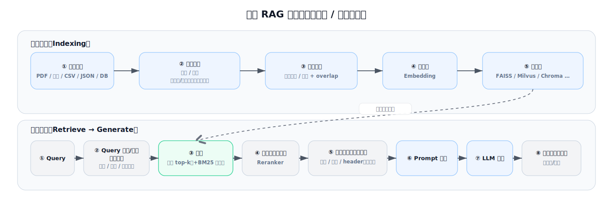

# Advanced RAG Techniques（中文版）

本仓库是对上游项目 **[`NirDiamant/RAG_Techniques`](https://github.com/NirDiamant/RAG_Techniques)** 的中文学习与复现版本，目标是：

- **按上游学习节奏**系统学习 RAG 技术（Foundational → Advanced）
- 提供**中文化**且尽量**可直接运行**的 notebooks
- 在不改变“学习结构/关键步骤”的前提下，尽量对齐**较新版本的 LangChain 写法**（默认以 `langchain==1.3.9` 为基准，详见 `requirements.txt`）。

---

## 你会得到什么

- **最小 RAG 模板**：加载 →（可选切分）→ 索引 → 检索 → 生成
- **调优方法**：chunk / query enhancement / retrieval / rerank / compression 的对照视角
- **可靠性增强**：相关性过滤、groundedness 检查、证据高亮等
- **评估闭环**：指标定义、端到端评测、以及多个评测框架/范式示例
- **高级架构**：RAPTOR / GraphRAG / Self-RAG / CRAG / MemoRAG 等

---

## RAG 流程概览

注：此图为通用流程；标注 **（可选）** 表示该步骤在很多系统中并非必需。



---

## 快速开始

### 1) 准备环境变量

- 复制 `.env.example` 为 `.env`
- 填写 `OPENAI_API_KEY`

### 2) 安装依赖

请在环境中自行安装依赖：

```bash
pip install -r requirements.txt
```

## 目录结构

```text
RAG_Techniques_CN/
├── all_rag_techniques/        # 主要学习材料：中文 notebook（*_cn.ipynb）
├── evaluation/                # 评估相关 notebook（*_cn.ipynb）
├── images/                    # 配图/示意图
├── data/                      # 示例数据与缓存数据（按 notebook 运行过程生成）
└── requirements.txt           # 依赖清单
```

---

## 学习路线（推荐）

- 按下方表格的 **“进度”** 从 1 开始顺序学习
- 大体节奏：**Foundational → Query Enhancement → Context Enrichment → Advanced Retrieval → Iterative → Evaluation → Advanced Architecture**

---

## Notebook 索引（按类别）

下面按类别汇总全部中文 notebook，并给出建议学习顺序（`进度`）。

### 🌱 Foundational（基础）

| 进度 | Technique | 中文 notebook | 核心解决什么（流程位置） |
|---:|---|---|---|
| 1 | Basic RAG | [`simple_rag_cn.ipynb`](all_rag_techniques/simple_rag_cn.ipynb) | 最小 RAG 闭环（索引→检索→生成） |
| 2 | RAG with CSV Files | [`simple_csv_rag_cn.ipynb`](all_rag_techniques/simple_csv_rag_cn.ipynb) | 表格行语义检索问答（索引→检索→生成） |
| 3 | Reliable RAG | [`reliable_rag_cn.ipynb`](all_rag_techniques/reliable_rag_cn.ipynb) | 相关性过滤 + groundedness 检查 + 证据高亮（可靠性） |
| 4 | Optimizing Chunk Sizes | [`choose_chunk_size_cn.ipynb`](all_rag_techniques/choose_chunk_size_cn.ipynb) | 选 chunk size 的权衡（切分） |
| 5 | Proposition Chunking | [`proposition_chunking_cn.ipynb`](all_rag_techniques/proposition_chunking_cn.ipynb) | 命题化提升检索粒度（切分/重写） |
| 6 | JSON RAG | [`json_rag_cn.ipynb`](all_rag_techniques/json_rag_cn.ipynb) | 多字段 JSON 入库与检索（加载→索引→检索） |

### 🔍 Query Enhancement（查询增强）

| 进度 | Technique | 中文 notebook | 核心解决什么（流程位置） |
|---:|---|---|---|
| 7 | Query Transformations | [`query_transformations_cn.ipynb`](all_rag_techniques/query_transformations_cn.ipynb) | 改写/分解/step-back 提升检索（查询增强） |
| 8 | HyDE (Hypothetical Document Embedding) | [`HyDe_Hypothetical_Document_Embedding_cn.ipynb`](all_rag_techniques/HyDe_Hypothetical_Document_Embedding_cn.ipynb) | 假想文档向量提升召回（查询增强） |
| 9 | HyPE (Hypothetical Prompt Embedding) | [`HyPE_Hypothetical_Prompt_Embeddings_cn.ipynb`](all_rag_techniques/HyPE_Hypothetical_Prompt_Embeddings_cn.ipynb) | 假想提示/意图向量提升召回（查询增强） |

### 📚 Context Enrichment（上下文增强）

| 进度 | Technique | 中文 notebook | 核心解决什么（流程位置） |
|---:|---|---|---|
| 10 | Contextual Chunk Headers | [`contextual_chunk_headers_cn.ipynb`](all_rag_techniques/contextual_chunk_headers_cn.ipynb) | chunk 加上下文头减少孤立（入库增强） |
| 11 | Relevant Segment Extraction | [`relevant_segment_extraction_cn.ipynb`](all_rag_techniques/relevant_segment_extraction_cn.ipynb) | 从长文抽关键段再进 prompt（检索后上下文增强） |
| 12 | Context Window Enhancement | [`context_enrichment_window_around_chunk_cn.ipynb`](all_rag_techniques/context_enrichment_window_around_chunk_cn.ipynb) | 检索命中后扩窗补上下文（检索后上下文增强） |
| 13 | Semantic Chunking | [`semantic_chunking_cn.ipynb`](all_rag_techniques/semantic_chunking_cn.ipynb) | 按语义边界切分（切分） |
| 14 | Contextual Compression | [`contextual_compression_cn.ipynb`](all_rag_techniques/contextual_compression_cn.ipynb) | 压缩/过滤上下文适配窗口（检索后上下文增强） |
| 15 | Document Augmentation | [`document_augmentation_cn.ipynb`](all_rag_techniques/document_augmentation_cn.ipynb) | 摘要/标签/重写后再索引（入库增强） |

### 🚀 Advanced Retrieval（高级检索）

| 进度 | Technique | 中文 notebook | 核心解决什么（流程位置） |
|---:|---|---|---|
| 16 | Fusion Retrieval | [`fusion_retrieval_cn.ipynb`](all_rag_techniques/fusion_retrieval_cn.ipynb) | 多路检索融合提升召回（检索增强） |
| 17 | Reranking | [`reranking_cn.ipynb`](all_rag_techniques/reranking_cn.ipynb) | 候选重排提升精度（检索增强） |
| 18 | Hierarchical Indices | [`hierarchical_indices_cn.ipynb`](all_rag_techniques/hierarchical_indices_cn.ipynb) | 多层索引粗到细（索引/检索架构） |
| 19 | Dartboard Retrieval | [`dartboard_cn.ipynb`](all_rag_techniques/dartboard_cn.ipynb) | 定向/分层检索策略（检索增强） |
| 20 | Multi-modal RAG with Captioning | [`multi_model_rag_with_captioning_cn.ipynb`](all_rag_techniques/multi_model_rag_with_captioning_cn.ipynb) | 图片→caption→文本 RAG（多模态转文本） |
| 21 | Multi-model RAG with ColPali | [`multi_model_rag_with_colpali_cn.ipynb`](all_rag_techniques/multi_model_rag_with_colpali_cn.ipynb) | 直接检索 PDF 页面图像（多模态检索） |

### 🔁 Iterative Techniques（迭代式）

| 进度 | Technique | 中文 notebook | 核心解决什么（流程位置） |
|---:|---|---|---|
| 22 | Retrieval with Feedback Loop | [`retrieval_with_feedback_loop_cn.ipynb`](all_rag_techniques/retrieval_with_feedback_loop_cn.ipynb) | 检索不佳→改写再检索（迭代检索） |
| 23 | Adaptive Retrieval | [`adaptive_retrieval_cn.ipynb`](all_rag_techniques/adaptive_retrieval_cn.ipynb) | 按问题动态选策略/参数（检索路由） |

### 📊 Evaluation（评估）

| 进度 | Technique | 中文 notebook | 核心解决什么（流程位置） |
|---:|---|---|---|
| 24 | Define Evaluation Metrics | [`define_evaluation_metrics_cn.ipynb`](evaluation/define_evaluation_metrics_cn.ipynb) | 定义 correctness/faithfulness/retrieval 指标（评估） |
| 25 | DeepEval | [`evaluation_deep_eval_cn.ipynb`](evaluation/evaluation_deep_eval_cn.ipynb) | 用 DeepEval 批量评测（评估） |
| 26 | GroUSE | [`evaluation_grouse_cn.ipynb`](evaluation/evaluation_grouse_cn.ipynb) | GroUSE 评测示例（评估） |
| 27 | End-to-End RAG Evaluation | [`end-2-end_rag_evaluation_cn.ipynb`](evaluation/end-2-end_rag_evaluation_cn.ipynb) | 端到端实验对比与汇总（评估闭环） |
| 28 | Open-RAG-Eval | [`open-rag-eval-example_cn.ipynb`](evaluation/open-rag-eval-example_cn.ipynb) | Open-RAG-Eval 评测管线（评估） |

### 🔬 Explainability（可解释）

| 进度 | Technique | 中文 notebook | 核心解决什么（流程位置） |
|---:|---|---|---|
| 29 | Explainable Retrieval | [`explainable_retrieval_cn.ipynb`](all_rag_techniques/explainable_retrieval_cn.ipynb) | 解释“为什么检索到这些”（可解释） |

### 🏗️ Advanced Architecture（高级架构）

| 进度 | Technique | 中文 notebook | 核心解决什么（流程位置） |
|---:|---|---|---|
| 30 | Graph RAG (LangChain) | [`graph_rag_cn.ipynb`](all_rag_techniques/graph_rag_cn.ipynb) | 图结构多跳检索（高级架构） |
| 31 | Microsoft GraphRAG | [`microsoft_graphrag_cn.ipynb`](all_rag_techniques/microsoft_graphrag_cn.ipynb) | Microsoft GraphRAG 流程（高级架构） |
| 32 | GraphRAG with Milvus VectorDB | [`graphrag_with_milvus_vectordb_cn.ipynb`](all_rag_techniques/graphrag_with_milvus_vectordb_cn.ipynb) | 向量库实现实体/关系/段落图检索（高级架构） |
| 33 | RAPTOR | [`raptor_cn.ipynb`](all_rag_techniques/raptor_cn.ipynb) | 层次摘要树检索长文（高级架构） |
| 34 | Agentic RAG | [`agentic_rag_cn.ipynb`](all_rag_techniques/agentic_rag_cn.ipynb) | Agent 编排检索/工具/生成（高级架构） |
| 35 | Self-RAG | [`self_rag_cn.ipynb`](all_rag_techniques/self_rag_cn.ipynb) | 生成过程中自评自检（自纠错） |
| 36 | Corrective RAG (CRAG) | [`crag_cn.ipynb`](all_rag_techniques/crag_cn.ipynb) | 发现问题后纠正再生成（自纠错） |
| 37 | MemoRAG | [`memorag_cn.ipynb`](all_rag_techniques/memorag_cn.ipynb) | 记忆增强检索与生成（记忆层） |

### 🌟 Special（特别条目）

| 进度 | Technique | 中文 notebook | 核心解决什么（流程位置） |
|---:|---|---|---|
| 38 | Sophisticated Controllable Agent | [`sophisticated_controllable_agent_cn.ipynb`](all_rag_techniques/sophisticated_controllable_agent_cn.ipynb) | 更可控的 Agent 与输出约束（控制层） |

---

## 致谢

- 上游项目：[`NirDiamant/RAG_Techniques`](https://github.com/NirDiamant/RAG_Techniques)
- 感谢原作者与社区贡献者提供的教程与实现

---

## 许可与使用限制

上游仓库 `RAG_Techniques` 使用的是**自定义许可**，核心约束是：

- **仅允许非商业用途（Non-Commercial Only）**
- **必须署名与标注来源（Attribution）**：包括作者名、上游链接、并说明你做了哪些修改
- **商业权利保留给上游作者**：如需商业用途，需要获得上游作者的书面授权

本仓库对上游内容进行了**中文翻译**，并对部分 notebook 做了 **LangChain API 版本更新与运行修复**。